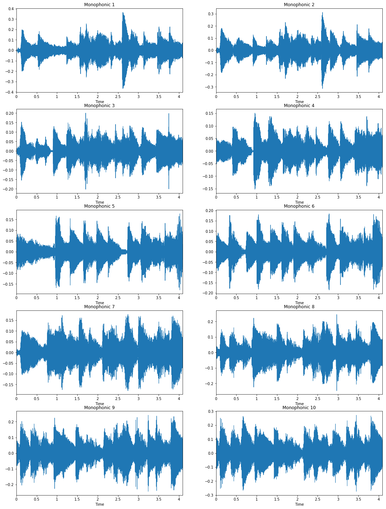

# WaveGAN v2 Pytorch

**Pytorch**  implementation of **WaveGAN** , a machine learning algorithm which learns to generate raw audio waveforms.


- **In v2 Added ability to train WaveGANs capable of generating longer audio examples (up to 4 seconds at 16kHz)**
- **In v2 Added ability to train WaveGANs capable of generating multi-channel audio**


This is the ported Pytorch implementation of WaveGAN (Donahue et al. 2018) ([paper](https://arxiv.org/abs/1802.04208)) ([demo](https://chrisdonahue.com/wavegan)) ([sound examples](http://wavegan-v1.s3-website-us-east-1.amazonaws.com)). WaveGAN is a machine learning algorithm which learns to synthesize raw waveform audio by observing many examples of real audio. WaveGAN is comparable to the popular DCGAN approach (Radford et al. 2016) for learning to generate images.

In this repository, we include an implementation of WaveGAN capable of learning to generate up to 4 seconds of audio at 16kHz.


WaveGAN is capable of learning to synthesize audio in many different sound domains. In the above figure, we visualize real and WaveGAN-generated audio of speech, bird vocalizations, drum sound effects, and piano excerpts. These sound examples and more can be heard [here](http://wavegan-v1.s3-website-us-east-1.amazonaws.com).

## Requirements

```
pip install -r requirements.txt
```

## Datasets

WaveGAN can now be trained on datasets of arbitrary audio files (previously required preprocessing). You can use any folder containing audio, but here are a few example datasets to help you get started:

- [Speech Commands Zero through Nine (SC09)](http://deepyeti.ucsd.edu/cdonahue/wavegan/data/sc09.tar.gz)
- [Drum sound effects](http://deepyeti.ucsd.edu/cdonahue/wavegan/data/drums.tar.gz)
- [Bach piano performances](http://deepyeti.ucsd.edu/cdonahue/wavegan/data/mancini_piano.tar.gz)

## WaveGan Parameters (params.py)
- target_signals_dir: folder including train subfolder contianing train wav data files
- model_prefix: model name used for saving mode
- n_iterations: number of train iterations
- lr_g: generator learning rate
- lr_d: discriminator learning rate
- beta11: Adam optimizer first  decay rate for moment estimates
- beta2:  Adam optimizer second  decay rate for moment estimates
- decay_lr: flag used to decay learning rate linearly through iterations till reaching zero at 100k iteration
- generator_batch_size_factor: in some cases we might try to multiply batch size by a factor when updatng the generator to give it a more correct and meaningful signal from the discriminator
- n_critic: updating the generator every n updates to the critic/ discriminator
- p_coeff: gradient penalty regularization factor
- batch_size: batch size during training default 10
- noise_latent_dim: dimension of the latent dim used to generate waves
- model_capacity_size: capacity of the model default 64 can be 32 when generating longer window length of 2-4 seconds
- output_dir: directory that contains saved model and saved samples during the training
- window_length: window length of the output utterance can be 16384 (1 sec), 32768 (2 sec), 65536 (4 sec)
- manual_seed: model random seed 
- num_channels: to define number of channels used in the data 


### Samples
- Model trained on piano dataset to generate 4 seconds using model capacity 32 for faster training
- Latent space interpolation to check the model give the following image

- A sample audio can be found at sample (from an early iteration with 4 sec window)


### Quality considerations

If your results are too noisy, try adding a post-processing filter . You may also want to change the amount of or remove phase shuffle from models.py . Increasing either the model size  or filter length from models.py may improve results but will increase training time.

### Monitoring

The train script will generate a fixed latent space and save output samples to the output dir specified in the params.


## Contributions
This repo is based on [chrisdonahue's](https://github.com/chrisdonahue/wavegan) , [jtcramer's](https://github.com/jtcramer/wavegan) implementation and [mazzzystar](https://github.com/mazzzystar/WaveGAN-pytorch)


### Attribution

If you use this code in your research, cite via the following BibTeX:

```
@inproceedings{donahue2019wavegan,
  title={Adversarial Audio Synthesis},
  author={Donahue, Chris and McAuley, Julian and Puckette, Miller},
  booktitle={ICLR},
  year={2019}
}
```
